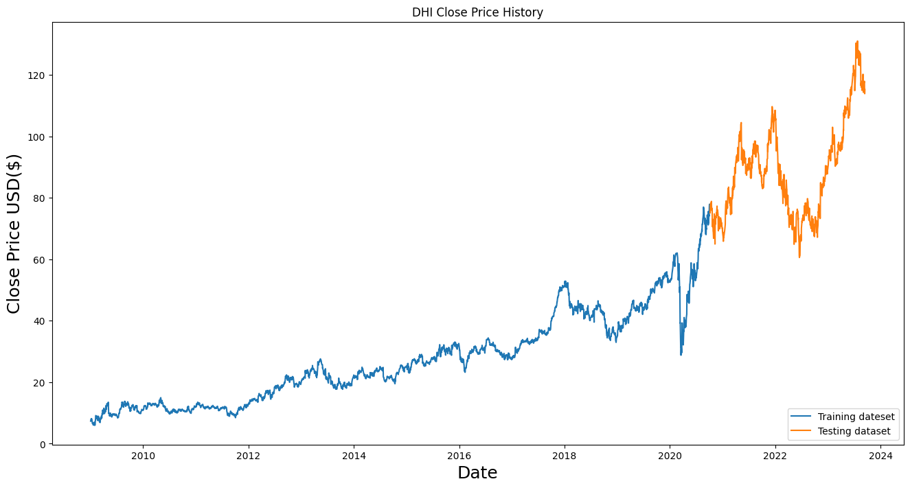
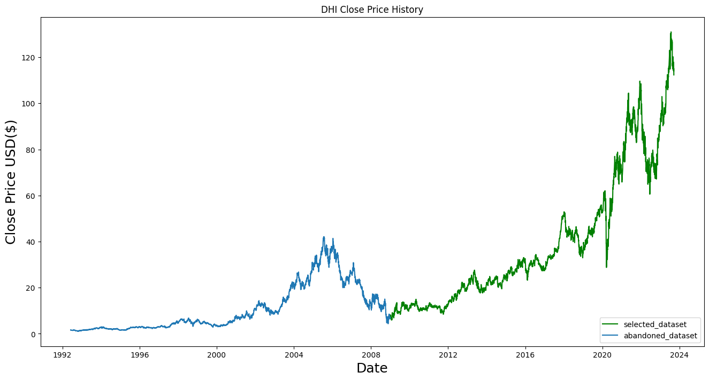

# Quantitative_Trading_LSTM
## Introduction
(This project is collaborated by two sophomore students, not yet completed)  
With the aim to gain a deeper understanding and direction to know more about quant trading, we would like to build a project including price prediction, backtesting and algo-trading to identify the major obstacles in it.

Therefore, instead of achieving highly efficient methods, we tend to perform a joruney of how we discover the unknown in quant trading.

 The project will mainly be dividied into two parts: price prediction with LSTM model and algo-trading.

## Method of Price Prediction

LSTM will be used widely in this project for predicting stock closing price although we desire to try other ways later 

### A Few Reasones to Use LSTM:
LSTM is a improved variant of RNN, specialised in learning data in sequence, such as time series data. Its combination of forget gate, input gate and output gate could catch the long-term pattern effectively.

 Also, please note that time series data can be divided into 4 parts: <b>Trend, Cycle, Seasonality, Noise</b> 

<ol>
  <li>Long-term dependencies 
      By </li>
  <li></li>
  <li></li>
</ol>

### Application of LSTM model:
At this stage, we will only use the historical closing price as the input during the training proess. 
And, we will only split selected historical data into training and test dataset, in which the test dataset will be the one closer to the present 

To make sure that LSTM model do learn a productive pattenrn in the training process and there is enough training and testing data, we only select stocks with a final monotone trend of closing price of more than 5 years as target. Also, we train the model only using the monotone trend for every target stock. 
  

## Structure of the project
### Model & Research
In this directory, we will show the process how we train the best-fit LSTM model for each target stock. And the result will be stored to Resources directory

### Resources
The best-models trained for every target stock will be placed here. A function is designed to gain the latest sets of predicted closing price of a stock by accessing its best-models here.

We want to train the model to fit to the test data.
